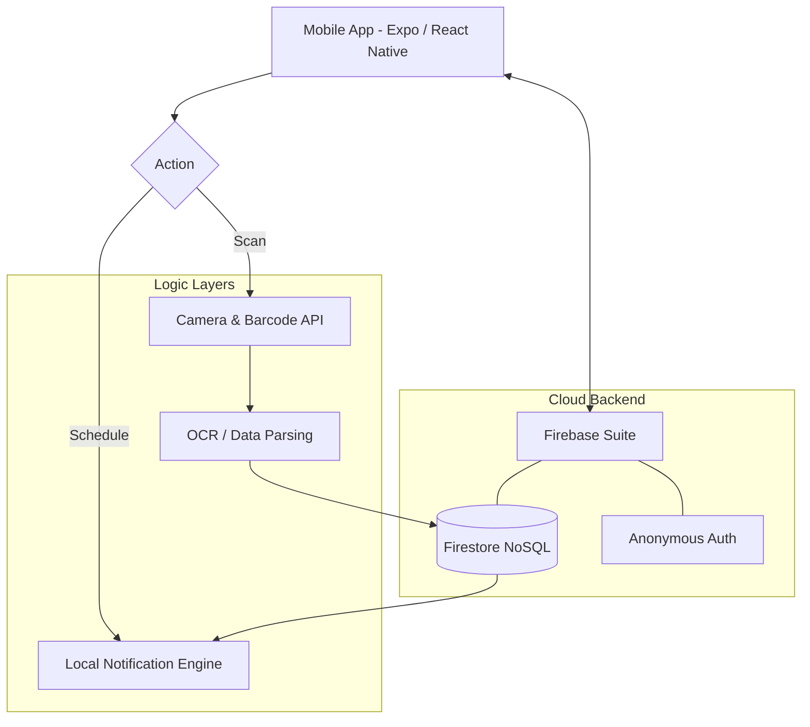

# 🩺 MedTrack AI — Smart Medication Tracker & Preventive Health Assistant

<div align="center">
  
  
  
</div>

<p align="center">
  <b>A 24-Hour Hackathon Project</b><br>
  <i>Empowering users to manage their medications safely through smart scanning, automated reminders, inventory tracking, and proactive alerts.</i>
</p>

---

## 🎯 Problem Statement

Medication mismanagement is a growing health concern that leads to:
- 📉 Missed and skipped doses
- ⚠️ Consumption of expired medicines
- 💊 Incorrect dosage tracking and overmedication
- 🏥 Poor chronic disease management
- 🚨 Increased healthcare risks and hospitalizations

Many users—especially elderly individuals and patients with chronic conditions—struggle to manually track complex medication schedules.

---

## 💡 Our Solution

**MedTrack AI** acts as a reliable, digital medication assistant that automates the tracking process:

- ✅ **Smart Scanning:** Scans medicines using the mobile device camera.
- ✅ **Auto-extraction:** Extracts medication information automatically using OCR and barcode parsing.
- ✅ **Inventory Management:** Tracks stock levels and expiry dates.
- ✅ **Intelligent Reminders:** Sends scheduled and escalating reminders.
- ✅ **Missed Dose Detection:** Detects delays and logs medication intake.
- ✅ **Proactive Alerts:** Warns users and caretakers before medicines run out.

---

## ✨ Main Features

### 📷 Medicine Scanner
- Scan medicine barcodes instantly.
- OCR fallback technology to read and parse medicine labels.
- Auto-fill medication details to minimize manual entry.
- User confirmation step before saving.

### 💊 Medication Management
- Seamlessly add medicine name, dosage, and frequency.
- Store and track expiry dates.
- Keep a real-time tally of pill inventory.
- View a comprehensive medication history.

### ⏰ Smart Reminders
- Reliable, offline-first scheduled dose notifications.
- Daily medication alerts tailored to the user's schedule.
- Missed dose detection and recording.
- One-tap **Taken / Skip** logging directly from the notification.

### ⚠️ Intelligent Alerts
- Expiry warnings triggered at **30 days, 7 days, and 1 day**.
- Low stock alerts when inventory hits defined thresholds.
- Missing medication alerts escalated to caregivers (e.g., notifying a nurse if a dose is delayed).
- General reminder escalation for repeated omissions.

### 📊 Comprehensive Dashboard
- Today’s personalized medication schedule.
- Timeline of upcoming doses.
- Health adherence tracking and analytics.
- Centralized Alert Center.

---

## 🧱 System Architecture



---

## 🛠️ Tech Stack

- **📱 Frontend:** React Native, Expo, Expo Go (Live Demo), TypeScript / JavaScript
- **📷 Scanning & AI:** `expo-camera`, `expo-barcode-scanner`, ML Kit OCR / Text Parsing
- **☁️ Backend:** Firebase Firestore, Firebase Authentication (Anonymous Login)
- **🔔 Notifications:** `expo-notifications` (Offline-first local notifications)
- **🗃️ State Management:** React Context API (or Zustand)

---

## 🗂️ Database Structure (Firestore NoSQL)

<details open>
<summary><b>View Schema Definitions</b></summary>

### `users`
| Field | Type | Description |
|---|---|---|
| `userId` | `string` | Unique identifier generated by Firebase Auth |
| `createdAt` | `timestamp` | Account creation date |

### `medications`
| Field | Type | Description |
|---|---|---|
| `id` | `string` | Unique document ID |
| `name` | `string` | Name of the medicine |
| `dosage` | `string` | Prescribed dosage (e.g., 500mg) |
| `expiryDate` | `timestamp` | Expiration date |
| `totalQuantity` | `number` | Total pills initially added |
| `remainingQuantity` | `number` | Current stock |
| `barcodeId` | `string` | Captured barcode |
| `imageUrl` | `string` | Reference image URL |

### `schedules`
| Field | Type | Description |
|---|---|---|
| `medicationId` | `string` | Reference to the medication |
| `doseTimes` | `array` | List of scheduled intake times (e.g., ['08:00', '20:00']) |
| `startDate` | `timestamp` | Schedule start |
| `endDate` | `timestamp` | Schedule end |

### `dose_logs`
| Field | Type | Description |
|---|---|---|
| `medicationId` | `string` | Reference to the medication |
| `scheduledTime` | `timestamp` | When it was supposed to be taken |
| `status` | `string` | Enum: `taken` or `missed` |
| `timestamp` | `timestamp` | Exact time the action was logged |

</details>

---

## 🔄 App Workflow

1. **Scan:** User scans their medicine bottle or box.
2. **Extract:** App parses formulation and extracts medication details.
3. **Verify:** User confirms the auto-filled information.
4. **Schedule:** User sets the intake schedule and current inventory constraints.
5. **Remind:** App schedules offline local reminders.
6. **Log:** User logs medication intake via push notifications.
7. **Update:** System updates stock in Firestore and triggers alerts if necessary.

---

## 👥 Team Structure (4 Members)

| Role | Primary Responsibility |
|------|------------------------|
| **Dev 1** | Scanner + Camera Integration & ML processing |
| **Dev 2** | Local Scheduling & Push Notification Engine |
| **Dev 3** | Inventory State Management & Alert Logic |
| **Dev 4** | UI/UX, Dashboard Creation, & Firebase Integration |

---

## ⏱️ Development Timeline (24 Hours)

- **Phase 1 — Setup (2 hrs):** Expo project setup, Firebase integration, Base navigation structure.
- **Phase 2 — Core Features (10 hrs):** Scanner implementation, Adding medication flow, Scheduling robust system.
- **Phase 3 — Logic Layer (6 hrs):** Reminder listeners, Inventory counting, Alert rules formulation.
- **Phase 4 — Polish & Presentation (6 hrs):** Dashboard UI overhaul, Demo optimization, QA & Bug fixes.

---

## 🧠 Core Alert Logic Code Snippets

```javascript
// Dose Reminder
if (currentTime === scheduledDose) {
  sendNotification();
}

// Missed Medication Escalation
if (timeSinceScheduled > 30 * MINUTES && !log.taken) {
  markAsMissed();
  notifyUser();
  notifyNurse(); // Escalated alert
}

// Low Stock Alert
if (remainingQuantity <= threshold) {
  notifyUserLowStock();
}

// Expiry Alert
if (daysToExpiry <= 30) {
  sendExpiryWarning();
}
```

---

## 🔒 Privacy & Security Considerations

- **Minimal Data:** Only strictly necessary, non-identifiable data is stored in the Firebase cloud.
- **Anonymous Auth:** Users can start tracking immediately without providing email or passwords.
- **Offline First:** Local notifications function entirely offline.
- **No PHI Storage:** No sensitive medical records are required or stored externally, complying with generic usage policies.

---

## 🎥 Demo Flow (For Judges)

1. **Capture:** Scan a medicine barcode live.
2. **Process:** Show auto-filled details extracting accurate data.
3. **Set:** Set a reminder for +1 minute into the future.
4. **Alert:** Receive the scheduled push notification.
5. **Action:** Mark the medicine as "taken" straight from the UI.
6. **Analytics:** Show the real-time inventory decrease on the dashboard.
7. **Edge Cases:** Manually trigger a low-stock or expiry alert to demonstrate proactive safety features.

---

## 🧑‍💻 Quickstart & Installation

Ensure you have **Node.js** and the **Expo CLI** installed. Download the [Expo Go](https://expo.dev/client) app on your Android or iOS device.

```bash
# Clone the repository
git clone https://github.com/your-team/medtrack-ai
cd medtrack-ai

# Install dependencies
npm install

# Start the Expo development server
npx expo start
```

*Open the Expo Go app and scan the generated QR code to live preview the application!*

<div align="center">
  <br/>
  <sub>Built with ❤️ during a 24-hour hackathon.</sub>
</div>
