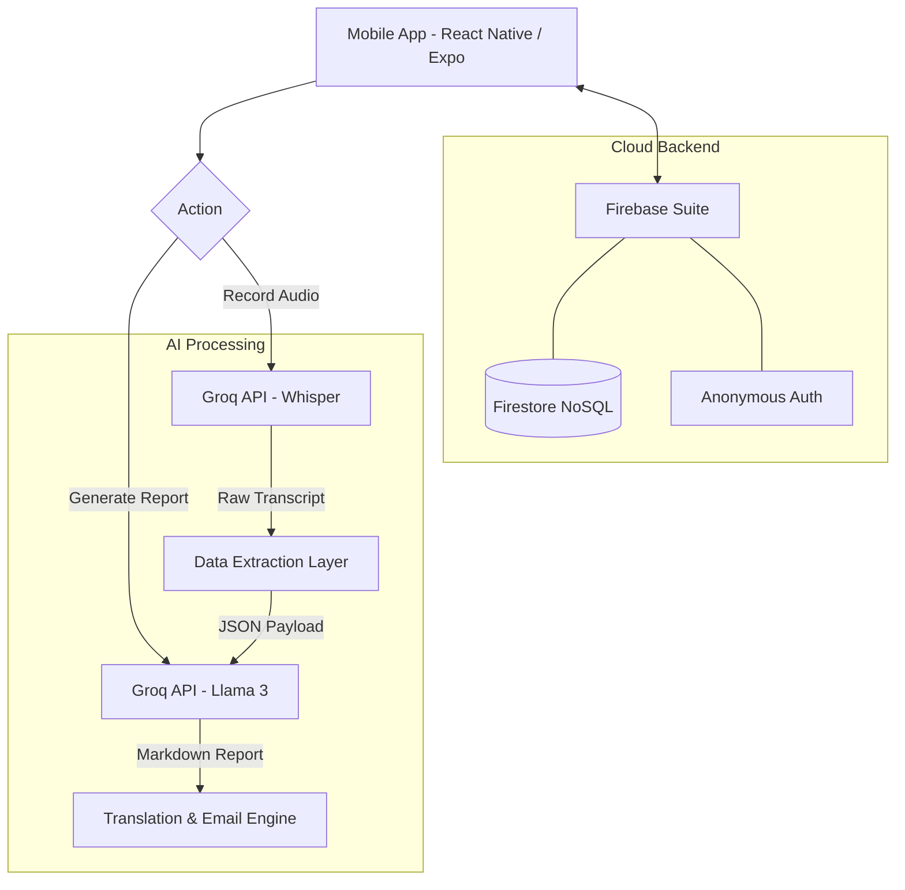

# 🩺 Diagnostic Assistant AI — Intelligent Clinical Scribe & EMR Bridge

<div align="center">
  
  
  
  
</div>

<p align="center">
  <b>A Diagnostic Assistant</b><br>
  <i>Capturing conversations between patients and clinicians, and translating them into structured data, accurate diagnoses, and helpful, understandable insights.</i>
</p>

---

## 🎯 Problem Statement
In fast-paced medical environments, clinicians spend extensive amounts of time documenting consultations, leading to burnout and reduced patient face-time. Additionally, medical jargon and complex reports often leave patients confused about their recovery plans. 

Mountains of unstructured conversational data need to be captured accurately and distilled down into concise, helpful, and easily integratable EMR content.

---

## 💡 Our Solution
**Diagnostic Assistant AI** serves as an intelligent bridge between raw clinical conversations and structured medical records. 

Through advanced AI and high-speed Speech-to-Text inference, the application listens to consultations and:
1. **Transcribes** dictations and interviews perfectly.
2. **Extracts** structured data (vitals, symptoms, medications).
3. **Generates** professional Clinical Summary Reports.
4. **Translates** medical jargon into patient-friendly, multilingual recovery plans.

This guarantees faster documentation and higher compliance, effectively acting as an elite Medical Scribe.

---

## ✨ Key Implementation Areas

### 🎙️ 1. Speech-to-Text Engine
- Powered by the ultra-fast **Groq API** utilizing the **Whisper-Large-v3** model.
- Converts clinician dictation or patient interviews into flawless text transcripts in real-time.
- Highly resilient to background noise and varying accents during dictation.

### 🧠 2. AI-Powered Summarization
- Leverages **Llama 3.3 70B** to intelligently extract key vitals, symptoms, and diagnoses directly from standard document text and conversational transcripts.
- Auto-populates a structured JSON schema, effortlessly isolating patient demographics from medical regimens.

### ⚕️ 3. ICD Code Mapping & Suggested Treatments
- The AI autonomously analyzes the chief complaints to map conditions to relevant clinical structures.
- Generates fully populated medication adherence plans, including suggested dosages, pill schedules, and refill necessities based on the transcript's context.

### 📝 4. Patient-Friendly Summaries
- Automatically formats generated clinical data into beautiful, readable Markdown reports.
- **Multilingual Support:** The application translates complex medical jargon into the patient's native language, creating an understandable recovery plan they can actually use.
- Allows seamless **Email Sharing** of translated reports directly to patients and emergency contacts.

### 🔌 5. Integration with Existing EMRs
- Outputs a neatly structured JSON payload containing cleanly separated objects (`demographics`, `medicines`, `notes`).
- Operates as a lightweight API-based model that can be instantly plugged into large-scale hospital EMR solutions without messy data wrangling.

---

## 🚀 Use Cases
- ⏱️ **Faster documentation during consultations:** Let the AI scribe while the doctor focuses on the patient.
- 📞 **Telehealth transcription and diagnosis support:** Perfect for online appointments requiring instant note-taking.
- 🚨 **Emergency room triage documentation:** Rapid data extraction during high-stress encounters.
- 🌍 **Multilingual support for diverse patient populations:** Break down language barriers and ensure patient comprehension.
- 🛡️ **Compliance and audit-ready records generation:** Keep comprehensive and legally compliant records formatted identically every time.

---

## 🧱 System Architecture



---

## 🛠️ Tech Stack

- **📱 Frontend:** React Native, Expo, TypeScript
- **🧠 AI & Inference:** Groq API (`whisper-large-v3`, `llama-3.3-70b-versatile`)
- **☁️ Backend & DB:** Firebase Authentication, Firestore NoSQL
- **🔔 Utilities:** Expo Audio Recording, Mail/Sharing intents

---

## 🧑‍💻 Quickstart & Installation

Ensure you have **Node.js** and the **Expo CLI** installed.

```bash
# Clone the repository
git clone https://github.com/riyan42069/hackathon
cd hackathon/something

# Install dependencies
npm install

# Set up your Environment Variables in a .env file:
# EXPO_PUBLIC_GROQ_API_KEY="your-groq-api-key"
# (Also include Firebase config keys if needed)

# Start the Expo development server
npx expo start
```

*Open the Expo Go app and scan the generated QR code to live preview the application on your physical device to test the microphone/recording features!*

<div align="center">
  <br/>
  <sub>Built with ❤️ during the Hackathon.</sub>
</div>
